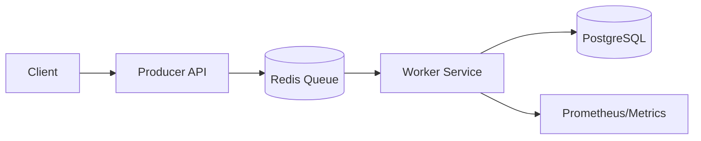
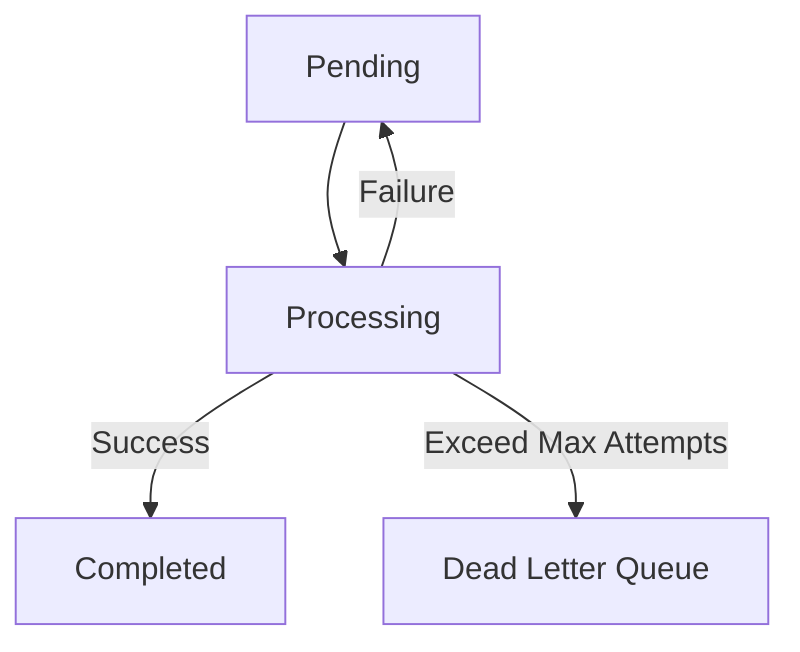

# Distributed Task Queue System

## Executive Summary
A production-grade, asynchronous task processing architecture designed for high availability and fault tolerance. This system decouples heavy request ingestion from background processing, ensuring reliable execution through an "in-flight" queue pattern, exponential backoff, and automated dead-letter routing.

## System Architecture
The following diagram illustrates the flow of jobs through the system, from the API ingestion point to persistent state storage.



## Core Engineering Pillars

* **Reliability:** Implements *At-Least-Once* delivery by utilizing an in-flight queue (`task_processing`) to prevent data loss during worker crashes.
* **Resilience:** Features an automated recovery service that detects and re-queues "stuck" jobs after worker nodes fail.
* **Observability:** Integrated with **Prometheus/Actuator** for real-time monitoring of queue depth and throughput.
* **Fault Tolerance:** Configurable retry logic with exponential backoff and persistent state management via PostgreSQL.
* **Idempotency:** Built-in protection against duplicate job submission via Redis-backed keys.

## Data Flow & Resilience

The system manages job transitions through the following state machine, ensuring that no job is lost even if a component terminates unexpectedly.



## Tech Stack

* **Producer API:** Spring Boot (Java 17) REST service.
* **Worker Service:** Spring Boot background daemon.
* **Message Broker:** Redis (List-based queue).
* **Persistence:** PostgreSQL (Single source of truth).
* **Monitoring:** Prometheus & Micrometer.
* **Frontend:** Next.js & Tailwind CSS (Operations Dashboard).

## Key Technical Challenges Solved

1. **The Consumer Crash Problem:** Resolved via atomic `rightPopAndLeftPush` Redis operations to ensure jobs are never lost, even if a worker crashes mid-process.
2. **Exponential Backoff:** Implemented intelligent retry logic to handle transient downstream API failures without overwhelming system resources.
3. **Ghost Job Recovery:** Developed a `RecoveryWorker` to reconcile state between Redis and Postgres, automatically identifying and re-queuing jobs stranded by unexpected process termination.

## How to Run

1. Ensure Docker Desktop is running.
2. Build and orchestrate the environment:

```bash
docker compose up -d --build
```

3. Access the Operations Dashboard at `http://localhost:3000`.
