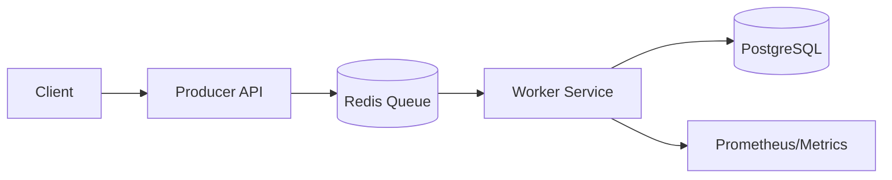
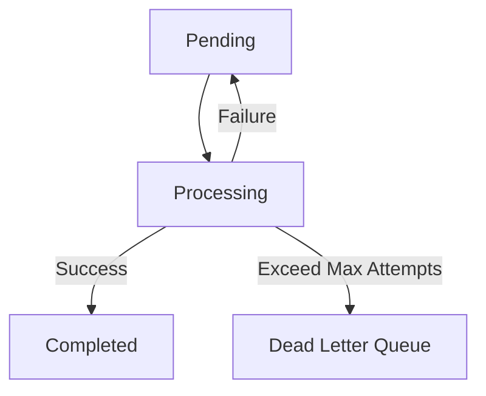

# Distributed Task Queue System

## Executive Summary
A production-grade, asynchronous task processing architecture designed for high availability and fault tolerance. This system decouples heavy request ingestion from background processing, ensuring reliable execution through an "in-flight" queue pattern, exponential backoff, and automated dead-letter routing.

## Live Demo
**Operations Dashboard:** [Insert Your Vercel URL Here]

*(Note: The backend is hosted on a free Render tier, which spins down after 15 minutes of inactivity. Please allow 30-60 seconds for the initial API container to boot up when making your first request).*

## System Architecture
The following diagram illustrates the flow of jobs through the system, from the API ingestion point to persistent state storage.

## Core Engineering Pillars

* **Reliability:** Implements *At-Least-Once* delivery by utilizing an in-flight queue (`task_processing`) to prevent data loss during worker crashes.
* **Resilience:** Features an automated recovery service that detects and re-queues "stuck" jobs after worker nodes fail.
* **Observability:** Integrated with **Prometheus/Actuator** for real-time monitoring of queue depth and throughput.
* **Fault Tolerance:** Configurable retry logic with exponential backoff and persistent state management via PostgreSQL.
* **Idempotency:** Built-in protection against duplicate job submission via Redis-backed keys.

## Data Flow & Resilience

The system manages job transitions through the following state machine, ensuring that no job is lost even if a component terminates unexpectedly.

## Tech Stack

* **Producer API:** Spring Boot (Java 17) REST service.
* **Worker Service:** Spring Boot background daemon.
* **Message Broker:** Redis (List-based queue).
* **Persistence:** PostgreSQL (Single source of truth).
* **Monitoring:** Prometheus & Micrometer.
* **Frontend:** Next.js & Tailwind CSS (Operations Dashboard).

## Key Technical Challenges Solved

1. **The Consumer Crash Problem:** Resolved via atomic `rightPopAndLeftPush` Redis operations to ensure jobs are never lost, even if a worker crashes mid-process.
2. **Exponential Backoff:** Implemented intelligent retry logic to handle transient downstream API failures without overwhelming system resources.
3. **Ghost Job Recovery:** Developed a `RecoveryWorker` to reconcile state between Redis and Postgres, automatically identifying and re-queuing jobs stranded by unexpected process termination.

---

## End-to-End Production Testing

Now that everything is live, here is how you run the ultimate validation test. This proves your Vercel frontend is successfully communicating with your Render backend.

### Step 1: The Cold Start Wake-Up

1. Open your Vercel URL in your browser.
2. The dashboard might show a loading state or an error initially. This is completely normal for free tiers. It means your Render API is "waking up."
3. Open your Render dashboard in another tab and watch the **Producer API** logs. Wait until you see the `Tomcat started on port 10000` log.
4. Refresh your Vercel frontend. It should now successfully fetch the initial (empty or historical) queue metrics.

### Step 2: The UI Injection Test

1. On your Vercel dashboard, use your UI controls to submit a new job (e.g., payload: `\"Vercel to Render Test\"`).
2. Immediately check your **Worker Service** logs in Render.
3. You should see the exact sequence we validated earlier:
   * `Picked up job [UUID]`
   * `Processing job [UUID] (Attempt 1/3)`
   * `Job [UUID] completed successfully`
4. Look back at your Vercel dashboard. The "Completed" metric should increment, or the job should appear in the completed table.

### Step 3: The DLQ Visualization Test

1. Use your Vercel dashboard to submit the poison pill payload (`{\"payload\": \"simulate-failure\"}`).
2. Watch the dashboard metrics. You should see the job stuck in "Processing" or "Pending" for about 6–8 seconds as the backend executes the exponential backoff (Attempt 1, wait 2s, Attempt 2, wait 4s, Attempt 3).
3. After the final attempt fails, the dashboard should update to show that the Dead Letter Queue (DLQ) metric has incremented.

This fully distributed, visually verifiable system acts as a perfect landing page for technical recruiters, demonstrating a complete understanding of full-stack, cloud-native engineering.
